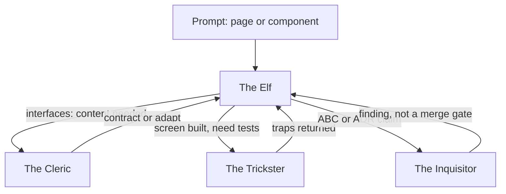
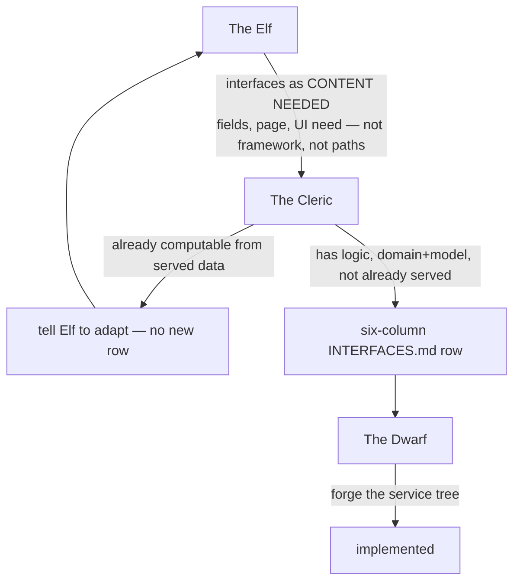
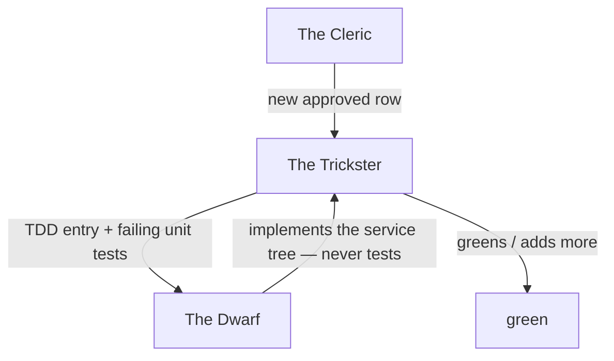
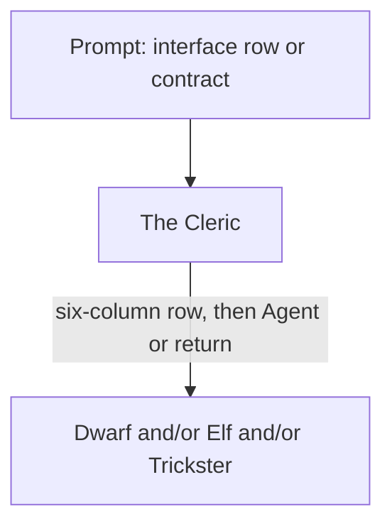
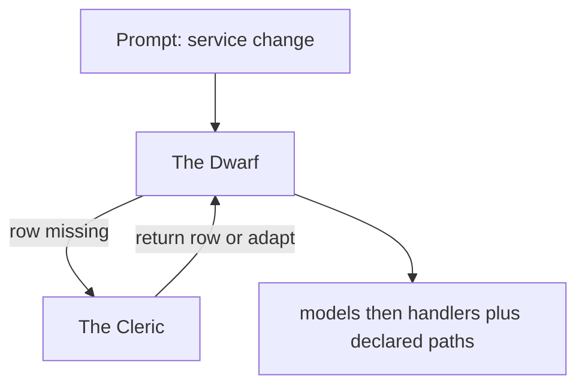
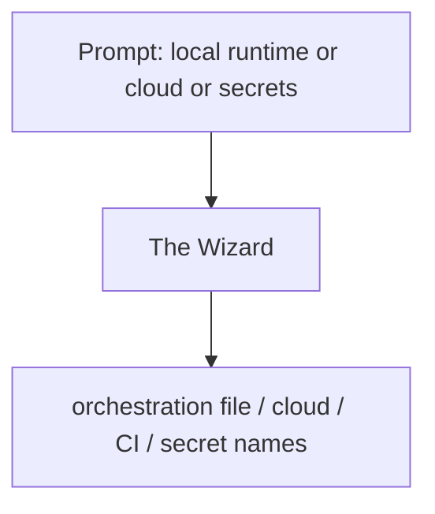
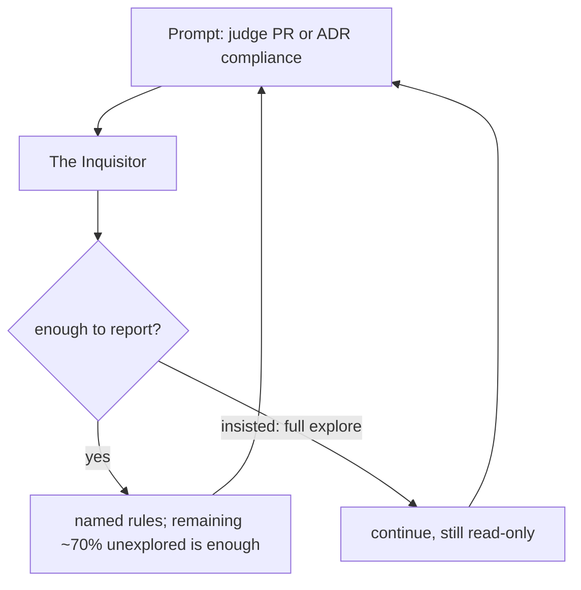
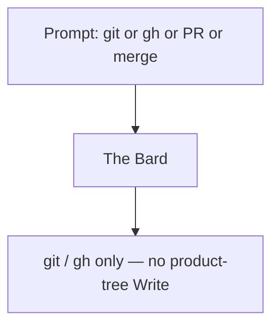
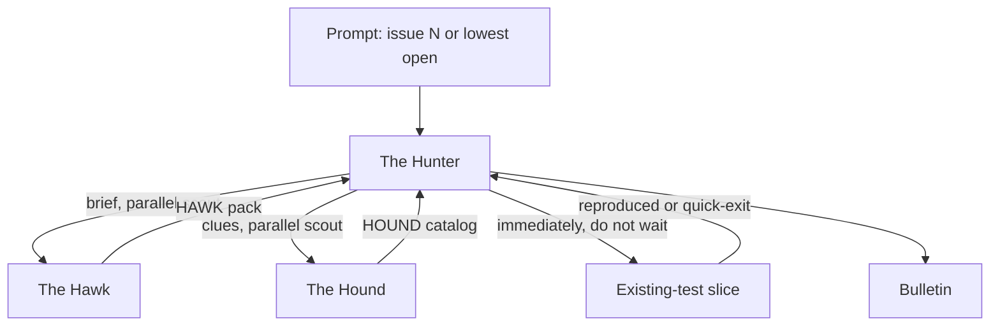

# ADND-DISPATCH — soft graphs

> Included from [[ADND-AGENTS]]. Roster, areas, and "who knows whom" live there. This file is only **how to proceed** from a class of user prompt.

**Soft:** a parent or subagent is expected to follow these graphs. It is not a hard `agentType` resolver. Do not hand-dispatch archived `kwf-*` nodes from here.

**Host-agnostic:** the node labels are stems (`hb-ag-contracts`, `hb-ag-service`, `hb-ag-surface`, `hb-ag-ops`, `hb-ag-judge`, `hb-ag-test`, `hb-ag-git`, `hb-ag-hunter`, `hb-ag-hawk`, `hb-ag-hound`). Where the host has no native type for a stem, the parent loads `agents/<stem>.md` and still obeys the graph.

The development loop (idea → [[INTERFACES]] → TDD → screen) remains [[DEVELOPMENT-LOOP]]. These graphs name **which agent** walks each step.

## Recursion (always)

- **The Cleric** has `Agent` (Dwarf, Elf, Trickster). After the catalog hunk: call the next owner, or return the row / adaptation instruction.
- **The Trickster** has no `Agent`. Returns the traps. Does not spawn Dwarf / Elf to "fix" a red.
- **The Inquisitor** has no product `Write` and does not spawn builders to "fix" a finding. Returns the named rule. Not a merge gate.
- **The Bard** has no `Agent`. Does not write app code while shipping. Does not spawn builders to "fix" a red on the way to `main`.
- **The Hunter** has `Agent` (Hawk, Hound only). Does not Agent area owners. Does not spawn a builder to "fix" the issue.
- **The Hawk** and **The Hound** have no `Agent`. They return a pack to The Hunter.
- Do not nest two Inquisitor calls.
- **Elf never Agents Dwarf. Dwarf never Agents Elf.** Only The Cleric carries messages both ways.
- One missing-row trip to The Cleric per need. Do not edit [[INTERFACES]] from Dwarf, Elf, or Trickster.
- **git / PR / merge → Bard.** No area owner may `git` or `gh`. The hunting party may `gh` issues only.
- **Issue hunt → Hunter.** Area owners do not Agent the hunting party. The hunting party does not Agent area owners.

## Prompt class → first agent

Classify the **user's ask**, not the files you wish were in scope. Then follow the matching graph.

| Prompt class | First agent | Then if |
|---|---|---|
| New/changed page, component, tokens, surface UI | The Elf | Interface content needed → Cleric (not framework, not paths). Tests → Trickster. **Never** Dwarf. ABC/ADR claim → Inquisitor |
| New/changed model, handler, permission, domain service | The Dwarf | Row missing → Cleric. Tests / `docs/tdds/` → Trickster. **Never** Elf. ABC/ADR claim → Inquisitor |
| Add/change/retire an interface **row** or `docs/contracts/` | The Cleric | Translate to a six-column row and/or request Dwarf; return the contract or "adapt" to Elf |
| Elf asks for **interfaces** (fields, page, UI need) | The Cleric | If already computable from served data: tell Elf to adapt (no row). If new: row, then Trickster (TDD) then Dwarf |
| `docs/tdds/`, service tests, surface tests, harness tests | The Trickster | Write the traps; return. Parent (or Cleric) sends Dwarf / Elf to implement. Trickster does not spawn them |
| Local orchestration file, profiles, bind-mounts, ports | The Wizard | Dispatch. Not The Dwarf |
| Cloud services, load balancing, secret-store names | The Wizard | Dispatch. Not The Dwarf. Do not invent infrastructure the layout lacks |
| "Does this PR / plan / diff comply with PRD, ADRs, or INTERFACES?" | The Inquisitor | Quick-exit report. Do not author a fix. Parent may load `hb-sk-abc`; Inquisitor does not |
| "Does this comply with adr-NN?" / about to assert ADR compliance | The Inquisitor | Area owner must **call**. Do not self-certify |
| Writing `adrs/` itself | guardian `kbot-adr` | Not The Inquisitor. Watchlist in [[AGENTS]] |
| `git`, commit, push, PR, merge | The Bard | Quick-exit. No area owner. Bard does not patch product trees while shipping. Issue hunt is not this row |
| Lowest-numbered issue, issue triage, issue forensics, hunter bulletin | The Hunter | Parallel Hawk + Hound (`scout`). Immediate existing-test repro (quick-exit). Bulletin. **Never** an area owner |
| Ambiguous (screen + new interface + infra) | Parent splits | Catalog first (Cleric), tests (Trickster), then Dwarf, then Elf; infra last (Wizard). Surface↔service only through Cleric. Ship via Bard. Inquisitor after the product hunk if ABC is in question |

Undeclared route in code is a defect ([[INTERFACES]]). Inventing a path on the surface is the same defect.

## Graph — user-facing page

A page binds to a **declared** row in [[INTERFACES]]. The surface toolchain only. Screen copy in `{{interface language}}` ([[adr-01.b-localization]]). The Elf does not Agent The Dwarf.

## Graph — interface request (Elf → Cleric → Dwarf)

The Cleric is the sole write on [[INTERFACES]]. The Dwarf waits for the row, then forges. If the need is already computable: no new row.

## Graph — TDD (Cleric → Trickster → Dwarf)

The Dwarf never writes tests or TDD entries. Other agents are forbidden from writing tests. The Trickster cannot give face (no UI, not the product). Surface tests: after The Elf builds, The Trickster may use `hb-sk-surface-framework`.

## Graph — catalog only

The Cleric does not write routes or pages.

## Graph — service (no tests)

The service's own toolchain only. Pins in [[REQUIREMENTS]]. Tests are The Trickster's graph, not this one.

## Graph — Wizard (live)

The parent may dispatch The Wizard. Do not "fix" the layout's deliberate absences.

## Graph — Inquisitor (quick-exit)

Area owners **call** this graph when they would otherwise write "this follows the ADRs" without an interrogation. The Inquisitor does not load `hb-sk-abc`; the **parent** may. Do not patch in that turn. Prefer a lightweight high-context model at dispatch; `model: inherit` in the agent file.

`prd-fail` / `adr-fail` / `api-fail` **report**. They do not block an owner merge. A `Guardian-Verdict:` line is not a review label and is not The Inquisitor's to write ([[AGENTS]], [[PR-REVIEW-ROUTINE]]).

## Graph — Bard (git / GitHub)

`main` is the single line; `{{owner}}`; a PR is required; `--admin` when an owner merge would wait on checks ([[adr-08-github]]). The Bard does not write app code to "fix while shipping." Any area owner that hits git **returns**; the parent loads The Bard. Issue pick and triage are The Hunter.

## Graph — Hunter (issue hunt)

The Hunter fires Hawk and Hound, then **immediately** runs one existing-test slice to reproduce. It strips noise from the report and pins a bulletin at **The Three Feathers** — finished `problem` plus one specific `goal` — for a later Hunter. Quick-exit on the repro is enough. It does not write tests and does not Agent The Trickster. Scout packs fold into the bulletin when they land. Hawk: Graphify first, then `gh`. Hound: Graphify first, then Grep. Neither familiar loads [[PRD]]. The party does not Agent area owners.

## Parent session (any host)

1. Read [[ADND-AGENTS]] (this file is included there).
2. Classify the prompt with the table above.
3. Dispatch or impersonate **one** first agent. Do not implement another agent's tree in the same breath.
4. Follow `Then if` until the ask is done. Surface ↔ service traffic goes through The Cleric. Ship through The Bard.
