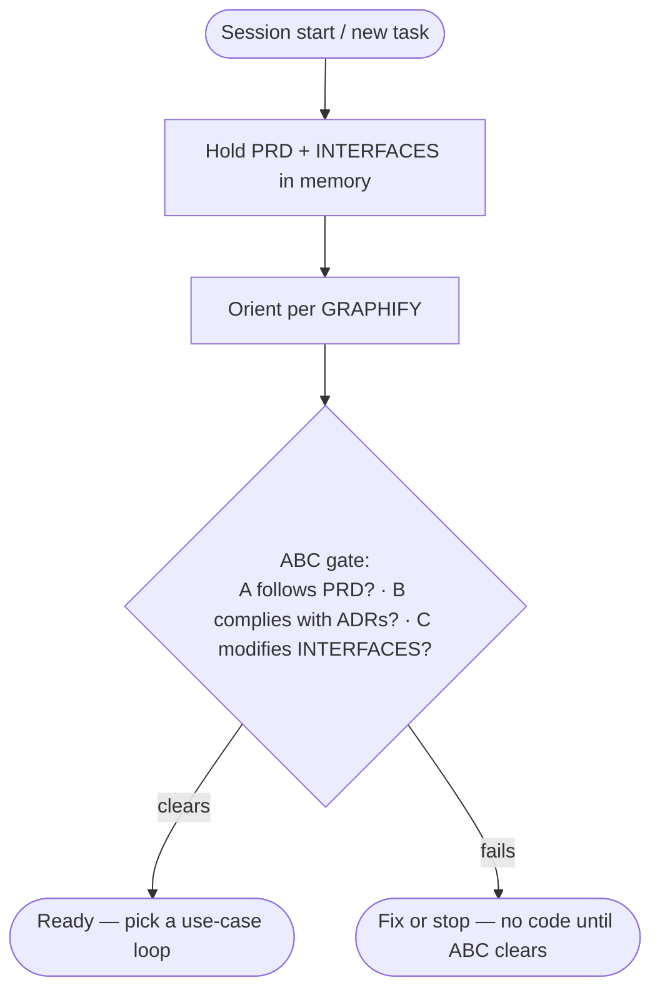
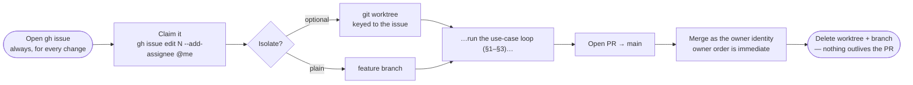
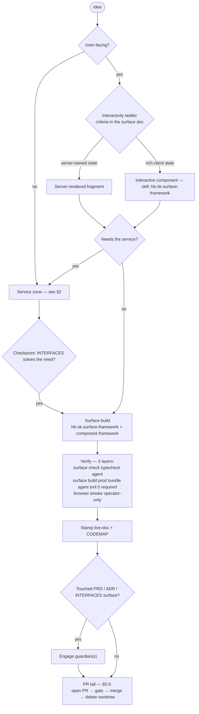
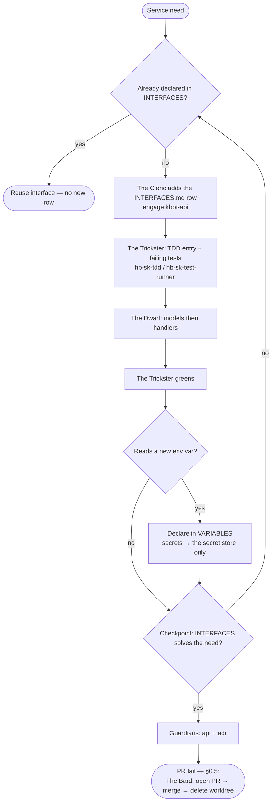
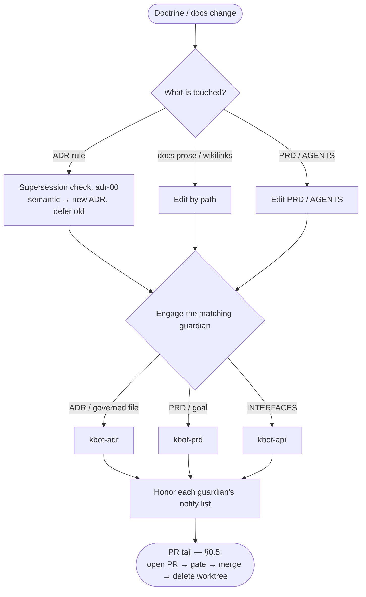

Open this before starting any code. It assumes [[PRD]] and [[INTERFACES]] are already held in memory (the standing requirement in [[AGENTS]]) and that the ABC gate has cleared.

## The canonical workflows — the definition

> A general definition, not a rigid script. The service zone is entered and exited only through [[INTERFACES]]; the checkpoint — "does [[INTERFACES]] solve the need?" — is what defines it.

**The development loop:**

`idea → user-facing? → … → needs the service? → enter through [[INTERFACES]]`

The service zone is entered only through [[INTERFACES]]. The surface requests **interfaces as content** (fields, page, UI need) via The Cleric (`hb-ag-contracts`) — not framework, not paths. Tests are The Trickster (`hb-ag-test`). Ship (`git` / `gh`) is The Bard (`hb-ag-git`).

1. Confirm the need cannot be met by the interfaces already declared in [[INTERFACES]].
2. If it cannot: The Cleric adds the row to [[INTERFACES]].
3. Enter the [[TDD]] flow — The Trickster writes the spec and failing tests (`hb-sk-tdd`, `hb-sk-test-runner`); The Dwarf implements.
4. **Checkpoint — does [[INTERFACES]] solve the need?** Yes → return to the surface track. No → loop back to 1.

The checkpoint is what defines the loop: the service zone is exited only when [[INTERFACES]] answers the feature's need.

**New service piece:**

`plan → The Cleric ([[INTERFACES]]) → The Trickster ([[TDD]]) → The Dwarf (models → handlers)`

**New user-facing feature:**

`The Warrior (surface) → interfaces content via The Cleric → The Trickster (tests)`
`         → needs the service? → The Trickster then The Dwarf → …`

Both are active: every gate binds now, wherever its subject exists. The sections below render each one step by step.

## 0 · Boot — orientation before any code

> Every use case shares this prefix: hold [[PRD]] and [[INTERFACES]] in memory, orient per [[GRAPHIFY]], then clear the ABC gate before touching any code.

Every use case shares this prefix. [[PRD]] and [[INTERFACES]] stay in memory. Orient per
[[GRAPHIFY]] ([[adr-35-graphify]]). Then the ABC gate ([[AGENTS]]).

## 0.5 · The change wrapper — issue in, PR out

> Every use-case loop opens with a `gh` issue and closes with a PR into `main`. A direct commit to `main` is never valid; the worktree is optional, the issue and PR are not.

Every use-case loop below is wrapped by the mandatory shape: it opens with a `gh` issue and closes with a PR, never a direct commit to `main`. The worktree is optional; the issue and the PR are not.

### The claim — the one step that is about the other sessions

**Assign the issue to yourself before you touch anything, and read the claims before you pick.** The assignee is the claim: it costs one `gh` call, needs no new machinery, and it is the only thing in this repo that says *someone is inside this work right now*.

| | |
|---|---|
| **Claim** | `gh issue edit <n> --add-assignee @me` — the moment you start, not when you finish |
| **Read** | `gh issue list --assignee @me` and `gh pr list` before you pick |
| **Release** | closing the issue, or `--remove-assignee @me` if you stop without finishing |

Skipping it is how two sessions find the same defect and repair it in parallel: one opens a PR and merges it, the other opens a second PR and throws both away. Neither could have known. A claim is not a lock and nothing enforces it. It is a signal, and it only works because the next session reads it before choosing what to open.

The tail `Open PR → gate → merge → delete worktree` is the close of every loop that follows; each §-loop renders only its own middle, entered after the issue and exited into the PR. SSOTs: [[adr-07-git]] · [[adr-08-github]] · [[GITHUB]] · guardians (`kbot-prd`/`-adr`/`-api`).

## 1 · Use case — a user-facing feature

> The master loop. The surface's own interactivity ladder decides between server-rendered and client-rich; the service excursion delegates to §2.

The master loop. Its ladder decision resolves through the surface architecture doc the project names at instantiation; its service excursion is §2.

Verify in order: the surface toolchain's **check** (typecheck, agent) → the surface toolchain's **build** (production bundle, agent, **headless, exit 0 required, before merge**) → browser smoke (operator-only, interactive). The build gate is neither smoke nor operator-only, and a green typecheck alone does not clear it.

SSOTs per step: the surface architecture doc · [[INTERFACES]] · [[CODEMAP]] · guardians (`kbot-prd`/`-adr`/`-api`) · [[GITHUB]].

## 2 · Use case — a new service interface

> The interface-first sequence: declare the row in [[INTERFACES]] first, enter the TDD flow, then exit only when the checkpoint confirms [[INTERFACES]] answers the need.

SSOTs per step: [[INTERFACES]] · [[TDD]] · [[SERVICES]] · [[VARIABLES]] · [[CODEMAP]] · guardians (`kbot-prd`/`-adr`/`-api`).

## 3 · Use case — a docs / doctrine change

> Docs are the product here. ADR rule changes run the supersession lifecycle; the matching guardian is engaged before the batch closes.

Here the docs *are* the product. An ADR rule change runs the supersession lifecycle ([[adr-00-adr-doctrine]]); prose is reached by path; the matching guardian is engaged before the batch closes.

SSOTs per step: [[adr-00-adr-doctrine]] · guardians (`kbot-prd`/`-adr`/`-api`) · [[GLOSSARY]] (a new name gets its row first) · [[GITHUB]].

## Variants

> Shorthand for the non-standard paths: surface-only, infra/cloud, smoke-test, and unattended runs.

- **Surface-only** change → the `Needs the service? = no` branch of §1; [[INTERFACES]] is never entered. The build gate still runs headless before merge: this branch carries the fewest gates, so the bundle is where a broken import or render error surfaces.
- **Infra / cloud** change → The Wizard (`hb-ag-ops`, `hb-sk-cloud` / `hb-sk-local-runtime`) in place of [[INTERFACES]]/[[TDD]]; the resource lands in the project's infrastructure inventory ([[INFRASTRUCTURE]]). Ship via The Bard.
- **Smoke tests** are operator-only and interactive; an agent routine that reaches a smoke step stops and defers ([[AGENTS]]).
- **Automated** — the §0.5 wrapper walked by an unattended process instead of a person: issue in, PR out, never a merge.
